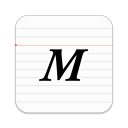
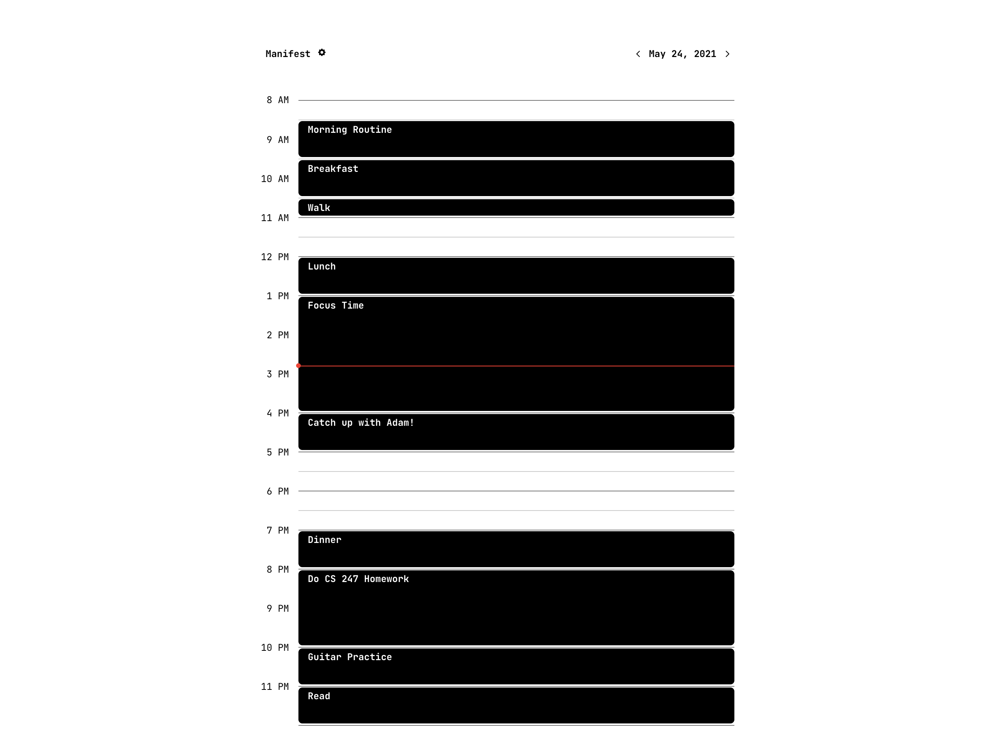

  

  <h1>Manifest</h1>

Manifest is a Chrome Extension that replaces your new tab page with a daily planner for your day.

There's a lot of friction involved with to-do list apps and calendars, which require you to open the app and check them multiple times a day. Manifest helps make you more productive by reminding you of your schedule every time you open a tab.

# Screenshots

# Developing
* Install the latest version of [`Node.js`](https://nodejs.org/en/)
* Run `npm install` to install dependencies
* In Chrome, go to 'Extensions' -> 'Manage Extensions' -> 'Enable Developer Mode'
* Run `npm run build`
    * Alternatively, `npm run watch` can be used to automatically re-build on each change
* Go back to Chrome, and under 'Manage Extensions' click 'Load Unpacked' and select the `build` folder
* Refresh changes and open a new tab
# Contributing

If you see any bugs with Manifest or want to suggest a new feature, please feel free open an issue. Manifest is an open-source project and is still in its early development stages - there are a lot of features planned and I appreciate any help I can get!
